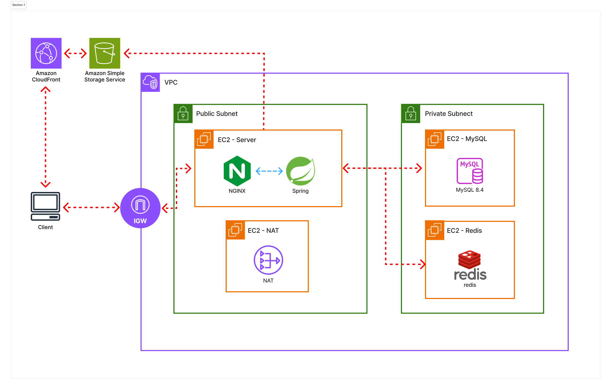
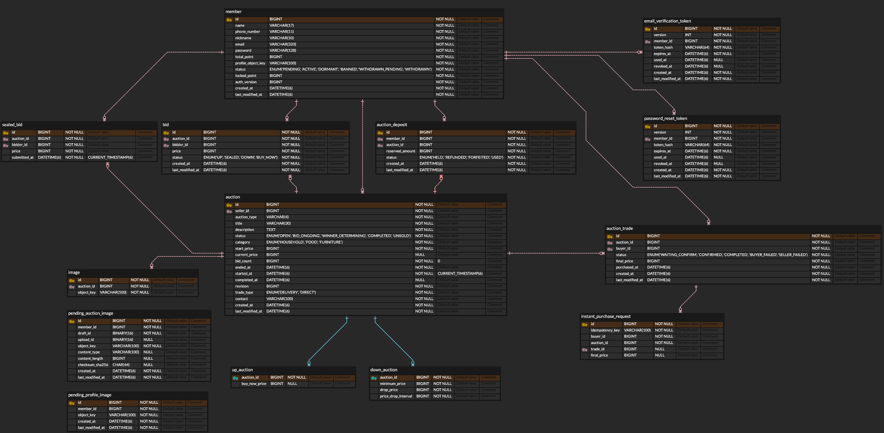

<p align="center">
  <h1 align="center">🏆 BidWin (비드윈)</h1>
  <p align="center">
    
    <br>
    <strong>급하게 처분해야 할 물건을 위한 하향경매 플랫폼</strong>
  </p>
</p>

<br>

<p align="center">
  <a href="#1-프로젝트-소개">프로젝트 소개</a> •
  <a href="#2-기획">기획</a> •
  <a href="#3-기능-소개">기능 소개</a> •
  <a href="#4-시스템-구성도">시스템 구성도</a> •
  <a href="#5-기술적 성과">기술적 성과</a> •
  <a href="#6-기술-스택">기술 스택</a> •
  <a href="#7-산출물">산출물</a> •
  <a href="#8-그라운드-룰">그라운드 룰</a> •
  <a href="#9-팀-구성">팀 구성</a>
</p>

<hr>

## 1. 프로젝트 소개
**Bidwin**은 판매자와 구매자가 적정 거래 가격을 더 빠르게 찾을 수 있도록 돕는 경매 기반 중고 거래 서비스입니다.

판매자는 상향 경매, 하향 경매, 즉시 구매 중 상황에 맞는 방식을 선택할 수 있습니다. Bidwin은 시간에 따른 가격 변화와 구매자 간 경쟁을 활용해 기존 중고 거래의 긴 판매 대기시간과 반복적인 가격 조정 문제를 해결합니다.

---

## 2. 기획

<details>
<summary><b>📖 기획 배경 및 문제 정의 (클릭하여 펼치기)</b></summary>

<br>

### 2.1 기획 배경

> 이사 당일, 아직 사용할 수 있는 매트리스를 결국 버려야 했다.  
> 조금 더 빠르게 가격을 조정할 수 있었다면 판매할 수 있지 않았을까?

기존 중고 거래는 판매자가 가격을 정해 상품을 등록한 뒤, 적절한 구매자가 나타날 때까지 기다리는 방식이 일반적입니다.

하지만 **이사나 공간 정리처럼 처분 기한이 정해진 상황에서는 구매자를 기다릴 시간이 부족**합니다. 판매자가 가격을 낮춰서라도 빠르게 판매하고 싶어도, 적절한 가격을 알기 어려워 직접 가격을 반복해서 수정해야 합니다.

**BidWin**은 이러한 문제를 해결하기 위해 시간의 흐름과 구매자 간 경쟁을 활용하여 거래 가격을 탐색하는 경매 방식을 도입했습니다.

### 2.2 사용자 페인포인트

#### 판매자

- 상품이 언제 판매될지 예측하기 어렵습니다.
- 빠르게 판매하려면 가격을 얼마나 낮춰야 하는지 판단하기 어렵습니다.
- 구매자의 반응을 확인하며 가격을 반복해서 수정해야 합니다.
- 처분 기한 안에 판매하지 못하면 아직 사용할 수 있는 물품도 폐기해야 합니다.
- 빠른 판매와 높은 판매 가격 중 어떤 선택이 유리한지 판단하기 어렵습니다.

#### 구매자

- 판매자와 가격을 협상하는 과정에서 시간과 노력이 필요합니다.
- 상품의 적정 가격을 판단하기 어렵습니다.
- 가격이 내려가기를 기다리다가 다른 구매자에게 상품을 놓칠 수 있습니다.
- 구매 의사가 있어도 판매자와 희망 가격이 달라 거래가 지연될 수 있습니다.

### 2.3 문제 정의

핵심 문제는 판매자가 **가격을 낮출 의향이 있어도**, 구매자가 **거래를 결정할 가격을 빠르게 찾기 어렵다는 점**입니다.

고정된 가격으로 구매자를 기다리는 기존 방식에서는 판매자와 구매자의 희망 가격 차이가 자연스럽게 좁혀지지 않습니다. 그 결과 거래가 지연되거나, 판매 가능한 물품이 거래되지 못한 채 폐기될 수 있습니다.

### 서비스 목표

Bidwin은 다양한 경매 방식을 통해 판매자와 구매자가 적정 거래 가격을 더 빠르게 찾을 수 있도록 지원합니다.

- 판매자가 판매 목적과 **처분 기한에 맞는 거래 방식**을 선택할 수 있도록 합니다.
- 판매자의 반복적인 가격 수정과 구매자의 **협상 부담을 줄입니다.**
- 판매 가능한 중고 물품이 거래되지 못하고 **폐기되는 상황을 줄입니다.**

### 2.4 해결 방법

| 사용자 문제 | 해결 방법 |
| --- | --- |
| 가격을 반복해서 수정해야 함 | **하향 경매**를 통해 시간에 따라 가격을 자동으로 낮춤 |
| 상품의 적정 가격을 판단하기 어려움 | **상향 경매**를 통해 구매자 간 경쟁으로 가격을 형성 |
| 기다리지 않고 거래를 확정하고 싶음 | **즉시 구매**를 통해 판매자가 설정한 가격으로 바로 거래 |
| 판매 시점을 예측하기 어려움 | 경매 종료 시간을 설정해 거래 기한을 명확하게 제공 |

</details>

---

## 3. 기능 소개

> [!NOTE]
> 아래 시연 GIF는 용량이 큽니다. 화면이 바로 보이지 않으면 로딩이 끝날 때까지 잠시 기다려 주세요.

### 🌟 하향 경매

- 판매자가 설정한 시작 가격에서 일정 시간이 지날 때마다 **가격이 단계적으로 내려가는** 경매 방식입니다.
- 구매자는 원하는 가격이 될 때까지 기다릴 수 있지만, 다른 사용자가 먼저 구매할 가능성도 있어 **가격과 구매 기회 사이의 긴장감**을 경험하게 됩니다. 판매자는 가격 조정을 통해 상품의 판매 가능성을 높일 수 있습니다.

<table width="100%">
  <tbody>
    <tr>
      <td align="center" height="420">
        
      </td>
    </tr>
  </tbody>
</table>

### 🌟 상향 경매

- 사용자들이 현재 최고 입찰가보다 높은 금액을 제시하며 경쟁하는 **일반적인 입찰 방식의 경매**입니다.
- 입찰 경쟁을 통해 상품의 가격이 자연스럽게 형성되며, 구매자는 원하는 상품을 확보하는 재미를, 판매자는 더 높은 가격에 판매할 기회를 얻습니다.

<table width="100%">
  <tbody>
    <tr>
      <td align="center" height="420">
        
      </td>
    </tr>
  </tbody>
</table>

### 🌟 밀봉 입찰

- 상향 경매는 마감 5분전부터 밀봉 입찰 상태가 됩니다. 밀봉 입찰 상태가 되면 **모든 사용자는 단 1번 입찰을 할 수 있고, 그 입찰가는 공개되지 않습니다.**
- 이후 경매가 종료되었을때 **가격이 높음 -> 먼저 입찰함 -> 가입 시기가 빠름** 순서대로 낙찰자를 판정합니다. 
- 밀봉 입찰을 도입함으로서 구매자는 낙찰 직전 발생한 상회 입찰로 인한 불쾌함을 방지하고, 판매자는 정시에 경매가 끝나는 안정성을 얻을 수 있습니다.

<table width="100%">
  <tbody>
    <tr>
      <td align="center" height="420">
        
      </td>
    </tr>
  </tbody>
</table>

### 🌟 즉시 구매

- 첫 입찰이 발생하기 전까지 판매자가 설정한 **즉시 구매 가격으로 상품을 바로 구매**할 수 있는 기능입니다.
- 구매자는 입찰 경쟁과 대기 없이 상품을 확정적으로 구매할 수 있고, 판매자는 원하는 가격에 상품을 빠르게 판매할 기회를 얻습니다.

<table width="100%">
  <tbody>
    <tr>
      <td align="center" height="420">
        
      </td>
    </tr>
  </tbody>
</table>

---

## 4. 시스템 구성도

### 4.1 시스템 아키텍처



### 4.2 ERD



### 4.3 패키지 구조

하나의 저장소에서 백엔드와 프론트엔드, 모니터링 설정을 함께 관리합니다.

```text
WEB-Team4-TIKITAKA
├── bidwin-back/        # Spring Boot API 서버 (Java 21)
├── bidwin-front/       # React 19 + Vite SPA (TypeScript)
├── deploy/             # 운영 모니터링 스택 설정 (Prometheus · Loki · Alloy · Grafana)
├── docs/images/        # 아키텍처 · ERD 다이어그램
├── .github/workflows/  # CI — 빌드·테스트 · PR 린트 · 라벨 동기화
└── compose.local.yaml  # 로컬 개발 환경 (MySQL · Redis · 모니터링)
```

백엔드는 **도메인별로 수직 분할**한 뒤, 각 도메인 안을 `presentation` → `application` → `domain` ← `infrastructure` **4계층으로 수평 분할**했습니다. 리포지토리와 외부 연동은 `domain`·`application`이 인터페이스로만 선언하고 구현은 `infrastructure`가 맡아, 도메인 규칙이 QueryDSL·Redis·S3 같은 기술 선택을 모르는 상태로 남습니다.

<details>
<summary><b>📦 백엔드 패키지 구조 (클릭하여 펼치기)</b></summary>

<br>

```text
bidwin-back/src/main/java/com/tikitaka/bidwinback
│
├── auction/                    # 경매 · 입찰 · 거래 — 서비스의 핵심 도메인
│   ├── presentation/           # 경매 등록·조회 · 입찰 · 즉시 구매 · 거래 확정 · SSE 구독 API + dto/
│   ├── application/            # 입찰 판정 · 즉시 구매 · 마감과 낙찰자 선정 · 보증금 정산 · 목록 조회
│   │   └── live/               # 실시간 상태 스냅샷 · 도메인 이벤트 정의
│   ├── domain/                 # 엔티티 · 가격 정책 · 리포지토리 계약
│   │   ├── entity/             # 경매 · 상향/하향 경매 · 입찰 · 밀봉 입찰 · 거래 · 보증금 · 이미지
│   │   ├── enums/              # 경매 · 거래 · 입찰 · 보증금 상태와 분류
│   │   ├── exception/          # 도메인별 예외
│   │   └── repository/         # 리포지토리 인터페이스 + 조회 전용 dto/
│   └── infrastructure/         # QueryDSL 목록 조회 · 마감 스케줄러 · 조회 지표
│       └── sse/                # 도메인 이벤트 → SSE 브로드캐스트
│
├── auth/                       # 인증 — 회원가입 · 로그인 · 메일 인증 · 비밀번호 재설정
│   ├── presentation/           # 인증 API + dto/
│   ├── application/            # 세션 인증 · 비밀번호 해싱 · 토큰 발급
│   │   ├── emailverification/  # 가입 메일 인증 토큰
│   │   └── passwordreset/      # 비밀번호 재설정 토큰
│   ├── domain/                 # 인증 토큰 엔티티 · 리포지토리 계약
│   └── infrastructure/         # PBKDF2 해시 · SHA-256 토큰 · Gmail SMTP
│
├── member/                     # 회원 · 프로필 · 보증금 포인트
│   ├── presentation/
│   ├── application/
│   └── domain/
│
├── mypage/                     # 내 입찰 · 판매 · 거래 · 보증금 이력 조회
│   ├── presentation/
│   ├── application/
│   └── domain/
│
├── upload/                     # S3 presigned 업로드 · 미회수 이미지 정리
│   ├── presentation/
│   ├── application/
│   ├── domain/
│   └── infrastructure/
│
└── global/                     # 도메인 공통 기반
    ├── auth/                   # 세션 인증 필터 · @Login 아규먼트 리졸버
    ├── sse/                    # SSE 연결 허브 · Redis Pub/Sub 이벤트 버스 · 하트비트
    ├── storage/                # S3 · CloudFront 추상화
    ├── common/                 # 공통 응답 봉투 · 페이지 응답 · 시각 감사 엔티티
    ├── config/                 # Session · Async · Scheduling · Mail · S3 · OpenAPI 설정
    ├── exception/              # 에러 코드 · 전역 예외 핸들러
    └── health/                 # 헬스 체크
```

</details>

<details>
<summary><b>📦 프론트엔드 디렉터리 구조 (클릭하여 펼치기)</b></summary>

<br>

```text
bidwin-front/src
│
├── app/                     # 라우터 · 루트 레이아웃 · 404
├── routes/                  # 페이지 단위 — 디렉터리 경로가 곧 URL
│   ├── auctions/            # 경매 목록 · 검색 · 필터 · 정렬
│   │   ├── components/      # 목록 카드 · 툴바 · 필터 패널
│   │   ├── detail/          # 경매 상세 — 실시간 가격 · 입찰
│   │   └── new/             # 경매 등록 · 이미지 업로더
│   ├── trades/detail/       # 거래 상세 — 실시간 상태 전이
│   ├── mypage/              # 프로필 · 보증금 · 내 물품
│   │   ├── components/      # 프로필 카드 · 보증금 충전 · 내 물품 섹션
│   │   ├── history/         # 입찰 · 판매 · 거래 · 보증금 이력
│   │   └── password/        # 비밀번호 변경
│   ├── login/               # 로그인
│   ├── signup/              # 회원가입 · 약관 동의
│   ├── email-verification/  # 메일 인증 랜딩
│   └── password-reset/      # 비밀번호 재설정 요청
│       └── confirm/         # 재설정 링크 확인
├── components/              # 라우트 간 공유 UI
│   ├── ui/                  # 버튼 · 모달 · 셀렉트 · 롤링 가격 등
│   ├── auth/                # 인증 화면 공통 레이아웃
│   ├── layout/              # 상단 내비게이션
│   └── feedback/            # 토스트
├── hooks/                   # SSE 구독 · 서버 시계 보정 · 카운트다운 훅
├── lib/                     # API 클라이언트 · 화면 공통 도메인 로직
│   ├── api/                 # 공통 응답 봉투 해제 + 엔드포인트 모듈
│   ├── auth/                # 인증 컨텍스트 · 입력 검증 규칙
│   └── clock/               # 서버 시계 컨텍스트
├── assets/                  # 로고 · 히어로 이미지
└── styles/                  # Tailwind v4 토큰 · 베이스 스타일
```

</details>

---

## 5. 기술적 성과
### 김근성
- [[김근성] 실행계획·인덱스·데이터 분포로 경매 마감 SQL 병목 추적 (5,001만 행 → 1만 행)](https://github.com/softeerbootcamp-8th/WEB-Team4-TIKITAKA/wiki/%5B%EA%B9%80%EA%B7%BC%EC%84%B1%5D-%EC%8B%A4%ED%96%89%EA%B3%84%ED%9A%8D%C2%B7%EC%9D%B8%EB%8D%B1%EC%8A%A4%C2%B7%EB%8D%B0%EC%9D%B4%ED%84%B0-%EB%B6%84%ED%8F%AC%EB%A1%9C-%EA%B2%BD%EB%A7%A4-%EB%A7%88%EA%B0%90-SQL-%EB%B3%91%EB%AA%A9-%EC%B6%94%EC%A0%81-(5,001%EB%A7%8C-%ED%96%89-%E2%86%92-1%EB%A7%8C-%ED%96%89))
- [[김근성] 단건 정산에서 Native Set‐based 정산까지 (21.15s → 1.05s)](https://github.com/softeerbootcamp-8th/WEB-Team4-TIKITAKA/wiki/%5B%EA%B9%80%EA%B7%BC%EC%84%B1%5D-%EB%8B%A8%EA%B1%B4-%EC%A0%95%EC%82%B0%EC%97%90%EC%84%9C-Native-Set%E2%80%90based-%EC%A0%95%EC%82%B0%EA%B9%8C%EC%A7%80-(21.15s-%E2%86%92-1.05s))
- [[김근성] SSE의 DB 커넥션 수명 결합 문제 해결](https://github.com/softeerbootcamp-8th/WEB-Team4-TIKITAKA/wiki/%5B%EA%B9%80%EA%B7%BC%EC%84%B1%5D-SSE%EC%9D%98-DB-%EC%BB%A4%EB%84%A5%EC%85%98-%EC%88%98%EB%AA%85-%EA%B2%B0%ED%95%A9-%EB%AC%B8%EC%A0%9C-%ED%95%B4%EA%B2%B0)
- [[김근성] 26회의 부하 테스트를 통한 SSE 병목 분리와 안정성 검증](https://github.com/softeerbootcamp-8th/WEB-Team4-TIKITAKA/wiki/%5B%EA%B9%80%EA%B7%BC%EC%84%B1%5D-26%ED%9A%8C%EC%9D%98-%EB%B6%80%ED%95%98-%ED%85%8C%EC%8A%A4%ED%8A%B8%EB%A5%BC-%ED%86%B5%ED%95%9C-SSE-%EB%B3%91%EB%AA%A9-%EB%B6%84%EB%A6%AC%EC%99%80-%EC%95%88%EC%A0%95%EC%84%B1-%EA%B2%80%EC%A6%9D)
- [[김근성] 쿼리 최적화와 Caffeine Single‐flight 캐싱을 통한 SSE 초기 스냅샷 개선 (p95 21.55s → 26.70ms)](https://github.com/softeerbootcamp-8th/WEB-Team4-TIKITAKA/wiki/%5B%EA%B9%80%EA%B7%BC%EC%84%B1%5D-%EC%BF%BC%EB%A6%AC-%EC%B5%9C%EC%A0%81%ED%99%94%EC%99%80-Caffeine-Single%E2%80%90flight-%EC%BA%90%EC%8B%B1%EC%9D%84-%ED%86%B5%ED%95%9C-SSE-%EC%B4%88%EA%B8%B0-%EC%8A%A4%EB%83%85%EC%83%B7-%EA%B0%9C%EC%84%A0-(p95-21.55s-%E2%86%92-26.70ms))
- [[김근성] Top‐K 알고리즘 도입을 통한 가격순 정렬 개선 (45s → 20s)](https://github.com/softeerbootcamp-8th/WEB-Team4-TIKITAKA/wiki/%5B%EA%B9%80%EA%B7%BC%EC%84%B1%5D-Top%E2%80%90K-%EC%95%8C%EA%B3%A0%EB%A6%AC%EC%A6%98-%EB%8F%84%EC%9E%85%EC%9D%84-%ED%86%B5%ED%95%9C-%EA%B0%80%EA%B2%A9%EC%88%9C-%EC%A0%95%EB%A0%AC-%EA%B0%9C%EC%84%A0-(45s-%E2%86%92-20s))


### 허찬욱
- [[허찬욱] 20만 건 부하테스트 직후 JVM 종료 (OOM)](https://github.com/softeerbootcamp-8th/WEB-Team4-TIKITAKA/wiki/%5B%ED%97%88%EC%B0%AC%EC%9A%B1%5D-20%EB%A7%8C-%EA%B1%B4-%EB%B6%80%ED%95%98%ED%85%8C%EC%8A%A4%ED%8A%B8-%EC%A7%81%ED%9B%84-JVM-%EC%A2%85%EB%A3%8C-(OOM))
- [[허찬욱] 가격 오름차순 Top‐K 조회 최적화](https://github.com/softeerbootcamp-8th/WEB-Team4-TIKITAKA/wiki/%5B%ED%97%88%EC%B0%AC%EC%9A%B1%5D-%EA%B0%80%EA%B2%A9-%EC%98%A4%EB%A6%84%EC%B0%A8%EC%88%9C-Top%E2%80%90K-%EC%A1%B0%ED%9A%8C-%EC%B5%9C%EC%A0%81%ED%99%94)
- [[허찬욱] 최신·마감임박순 정렬 병목 개선 — 필터 미기여 인덱스 교체](https://github.com/softeerbootcamp-8th/WEB-Team4-TIKITAKA/wiki/%5B%ED%97%88%EC%B0%AC%EC%9A%B1%5D-%EC%B5%9C%EC%8B%A0%C2%B7%EB%A7%88%EA%B0%90%EC%9E%84%EB%B0%95%EC%88%9C-%EC%A0%95%EB%A0%AC-%EB%B3%91%EB%AA%A9-%EA%B0%9C%EC%84%A0-%E2%80%94-%ED%95%84%ED%84%B0-%EB%AF%B8%EA%B8%B0%EC%97%AC-%EC%9D%B8%EB%8D%B1%EC%8A%A4-%EA%B5%90%EC%B2%B4)
- [[허찬욱] 추천순 집계 병목 개선 — bid_count 반정규화](https://github.com/softeerbootcamp-8th/WEB-Team4-TIKITAKA/wiki/%5B%ED%97%88%EC%B0%AC%EC%9A%B1%5D-%EC%B6%94%EC%B2%9C%EC%88%9C-%EC%A7%91%EA%B3%84-%EB%B3%91%EB%AA%A9-%EA%B0%9C%EC%84%A0-%E2%80%94-bid_count-%EB%B0%98%EC%A0%95%EA%B7%9C%ED%99%94)
- [[허찬욱] 목록 조회 트랜잭션 제거 검토 — 측정 후 미채택](https://github.com/softeerbootcamp-8th/WEB-Team4-TIKITAKA/wiki/%5B%ED%97%88%EC%B0%AC%EC%9A%B1%5D-%EB%AA%A9%EB%A1%9D-%EC%A1%B0%ED%9A%8C-%ED%8A%B8%EB%9E%9C%EC%9E%AD%EC%85%98-%EC%A0%9C%EA%B1%B0-%EA%B2%80%ED%86%A0-%E2%80%94-%EC%B8%A1%EC%A0%95-%ED%9B%84-%EB%AF%B8%EC%B1%84%ED%83%9D)
- [[허찬욱] 목록 COUNT 병목 개선 — 캐시 반려](https://github.com/softeerbootcamp-8th/WEB-Team4-TIKITAKA/wiki/%5B%ED%97%88%EC%B0%AC%EC%9A%B1%5D-%EB%AA%A9%EB%A1%9D-COUNT-%EB%B3%91%EB%AA%A9-%EA%B0%9C%EC%84%A0-%E2%80%94-%EC%BA%90%EC%8B%9C-%EB%B0%98%EB%A0%A4)


### 노승억
- [[노승억] 입찰 처리량은 왜 240 RPS에서 멈추는가](https://github.com/softeerbootcamp-8th/WEB-Team4-TIKITAKA/wiki/%5B%EB%85%B8%EC%8A%B9%EC%96%B5%5D-%EC%9E%85%EC%B0%B0-%EC%B2%98%EB%A6%AC%EB%9F%89%EC%9D%80-%EC%99%9C-240-RPS%EC%97%90%EC%84%9C-%EB%A9%88%EC%B6%94%EB%8A%94%EA%B0%80)
- [[노승억] Redis 원자적 필터, 무엇이 풀리고 무엇이 안 풀렸나](https://github.com/softeerbootcamp-8th/WEB-Team4-TIKITAKA/wiki/%5B%EB%85%B8%EC%8A%B9%EC%96%B5%5D--Redis-%EC%9B%90%EC%9E%90%EC%A0%81-%ED%95%84%ED%84%B0,-%EB%AC%B4%EC%97%87%EC%9D%B4-%ED%92%80%EB%A6%AC%EA%B3%A0-%EB%AC%B4%EC%97%87%EC%9D%B4-%EC%95%88-%ED%92%80%EB%A0%B8%EB%82%98)
- [[노승억] 입찰의 성공 실패 판정을 Redis로 이관하게 된다면 응답속도는 얼마나 개선이 될까?](https://github.com/softeerbootcamp-8th/WEB-Team4-TIKITAKA/wiki/%5B%EB%85%B8%EC%8A%B9%EC%96%B5%5D-%EC%9E%85%EC%B0%B0%EC%9D%98-%EC%84%B1%EA%B3%B5-%EC%8B%A4%ED%8C%A8-%ED%8C%90%EC%A0%95%EC%9D%84-Redis%EB%A1%9C-%EC%9D%B4%EA%B4%80%ED%95%98%EA%B2%8C-%EB%90%9C%EB%8B%A4%EB%A9%B4-%EC%9D%91%EB%8B%B5%EC%86%8D%EB%8F%84%EB%8A%94-%EC%96%BC%EB%A7%88%EB%82%98-%EA%B0%9C%EC%84%A0%EC%9D%B4-%EB%90%A0%EA%B9%8C%3F)
- [[노승억] 락의 순서만 맞추면 교착상태가 해결될까?](https://github.com/softeerbootcamp-8th/WEB-Team4-TIKITAKA/wiki/%5B%EB%85%B8%EC%8A%B9%EC%96%B5%5D-%EB%9D%BD%EC%9D%98-%EC%88%9C%EC%84%9C%EB%A5%BC-%EB%A7%9E%EC%B6%94%EB%A9%B4-%EA%B5%90%EC%B0%A9%EC%83%81%ED%83%9C%EA%B0%80-%ED%95%B4%EA%B2%B0-%EC%82%AC%EB%9D%BC%EC%A7%88%EA%B9%8C)

---

## 6. 기술 스택

| 구분 | 스택 |
| :---: | --- |
| **프론트엔드** |     |
| **백엔드** |          |
| **데이터** |     |
| **실시간 통신** |   |
| **인프라** |    
| **CI/CD** |   |
| **모니터링 · 성능** |        |
| **API 문서** |   |
| **협업** |      |

---

## 7. 산출물

| 산출물 | 상세 설명 | 링크 |
| :--- | :--- | :---: |
| **📊 통합 명세서** | 기능 명세서 · 요구사항 명세서 · API 명세서 · 이슈 단위 · 진행 요약 통합 시트 | [바로가기](https://docs.google.com/spreadsheets/d/1orIoqAX5NUv8rB3I7x58Ae_NT1sThZx6XoPvBz1oO6M/edit?gid=480022386#gid=480022386) |
| **📗 스웨거 (Swagger UI)** | 배포 서버에서 제공하는 HTTP API 문서 | [바로가기](https://api.bidwin.site/swagger-ui/index.html) |
| **🔗 이슈 관계도** | 이슈 분할과 선후 의존 관계(위상 정렬)를 정리 | [바로가기](https://github.com/softeerbootcamp-8th/WEB-Team4-TIKITAKA/wiki/이슈-관계도) |
| **🔄 상태 전이도** | 회원 · 경매 · 거래 도메인의 상태 전이 다이어그램 | [바로가기](https://github.com/softeerbootcamp-8th/WEB-Team4-TIKITAKA/wiki/상태-전이도) |
| **📑 상태 전이표** | 전이 조건과 부수 효과(보증금 처리 등)를 표로 고정 | [바로가기](https://github.com/softeerbootcamp-8th/WEB-Team4-TIKITAKA/wiki/상태-전이표) |
| **✅ 행위표** | 경매 상태별로 허용되는 사용자 행위 매트릭스 | [바로가기](https://github.com/softeerbootcamp-8th/WEB-Team4-TIKITAKA/wiki/행위표) |
| **🎨 디자인 시트** | 컬러 · 타이포그래피 · 컴포넌트 스타일 정의서 | [바로가기](https://github.com/softeerbootcamp-8th/WEB-Team4-TIKITAKA/wiki/%EB%94%94%EC%9E%90%EC%9D%B8-%EC%8B%9C%ED%8A%B8) |
| **🖼️ 와이어프레임** | 전체 화면 구성과 플로우 설계 | [바로가기](https://www.figma.com/design/j9T8YCyN5ILPBUmoHurPlc/Bidwin?node-id=0-1&t=nJuW1NwHBt89iUkY-1) |
| **📅 일정 관리 (GitHub Project)** | 스프린트 관리 및 Task 분배 | [바로가기](https://github.com/orgs/softeerbootcamp-8th/projects/8) |
| **📝 전체 문서 관리 (Notion)** | 매일 스크럼, 아이디어 회의, 주간 회고록 | [바로가기](https://softeer04.notion.site/HMG-Softeer-4-TIKITAKA-39f6b34e4aac80bcb442fdccba74ab57?source=copy_link) |
---

## 8. 그라운드 룰

<details>
<summary><b>🤝 [팀 Ground Rules] 우리 팀의 협업 & 소통 규칙 (클릭하여 펼치기)</b></summary>

<br>

### 1. 소통과 존중
* 팀원의 의견에는 먼저 긍정적으로 반응하고 끝까지 경청한다.
* 발언을 끊지 않는다. 중간에 의견을 더하고 싶다면 손을 들어 의사를 표시한다.
* 무조건 동의하지 않으며, 반대 의견은 감정이 아닌 논리와 기술적 근거로 설명한다.
* 불편한 감정이나 오해가 생기면 쌓아두지 말고 즉시 이야기한다.
* 감정적으로 행동하거나 말다툼이 예상되면 🦆**오리**🦆를 앞에 두고 차분하게 대화한다.
* 다른 팀원의 담당 범위를 수정하거나 대신 처리해야 할 때는 먼저 허락을 구한다.

### 2. 문제 및 진행 상황 공유
* 문제, 막힘, 지연 가능성이 생기면 해결 가능 여부와 관계없이 즉시 알린다.
* 막혔을 때는 짧게 스스로 고민한 뒤, 지체하지 않고 팀원에게 도움을 요청한다.
* 각자 진행 중인 작업과 현재 단계를 팀이 확인할 수 있도록 지속해서 공유한다.
* 요청사항과 업무 분담은 가능한 한 미리 정리하여 전달한다.
* 업무는 합의한 우선순위에 따라 처리하며, 모든 요청을 즉시 처리할 수 없음을 서로 이해한다.

### 3. 회의와 의사결정
* 매일 아침 10~20분간 데일리 스크럼을 진행한다.
  * 건강 상태
  * 전날 진행한 일
  * 오늘 할 일
  * 막힌 점과 도움이 필요한 부분
* 데일리 회의와 회고의 진행자는 매번 교대한다.
* 회의에는 종료 시간을 정하고, 논의가 길어지면 중재자의 진행을 따른다.
* 의견이 갈리면 기술적 근거를 바탕으로 짧은 토론을 진행한다.
* 결론이 나지 않으면 AI 또는 Dangle님의 조언을 참고하여 결정한다.
* 외부 마감 하루 전에는 팀 전체가 진행 상황과 결과물을 점검한다.

### 4. 기록과 업무 채널
* 결정 사항, 담당자, 일정, 변경 내용은 반드시 회의록에 기록한다.
* 회의·토론·개발 과정은 필요할 때 사진으로 남긴다.
* 공식 업무 소통은 지정된 슬랙 업무 채널에서 진행한다.
* 사적인 대화는 별도의 슬랙 채널을 이용한다.
* 구두로 합의한 중요한 내용도 공식 채널이나 회의록에 다시 남긴다.

### 5. 피드백
* 매일 짧게라도 건전한 피드백 시간을 갖는다.
* 피드백은 사람보다 행동과 결과물을 대상으로 한다.
* 솔직한 의견과 새로운 아이디어를 편하게 제시할 수 있는 분위기를 만든다.
* 피드백을 방어적으로 받아들이지 않고 개선을 위한 정보로 활용한다.

### 6. 건강과 휴식
* 매시 50분부터 정각까지 휴식한다.
* 장시간 계속 앉아 있지 않고 정기적으로 움직인다.
* 식사 시간을 지킨다. (점심: 오후 12시 30분 / 저녁: 오후 7시 00분)
* 밤샘을 지양하고 하루 최소 6시간 수면을 확보한다.
* 피로와 건강 상태가 업무와 태도에 영향을 줄 수 있음을 서로 배려한다.

### 7. 개발 원칙
* 개인의 작업이 다른 팀원의 작업에 영향을 줄 경우 변경 전에 알리고 협의한다.
* 일정뿐 아니라 유지보수성과 팀원이 이어서 작업할 수 있는 상태까지 고려한다.

</details>

---

## 9. 팀 구성

<table align="center" width="100%">
  <thead>
    <tr>
      <th align="center" width="20%">프로필 사진</th>
      <th align="center" width="20%">이름 / 역할</th>
      <th align="left" width="45%">담당 업무</th>
      <th align="center" width="15%">링크</th>
    </tr>
  </thead>
  <tbody>
    <tr>
      <td align="center">
</td>
      <td align="center"><b>김근성</b><br><sub>팀장, BE</sub></td>
      <td>
        <ul>
          <li><b>세션 기반 인증·인가 전반</b></li>
          <li><b>SSE 실시간 경매·거래 브로드캐스트</b></li>
          <li><b>스케쥴러 기반 경매 마감 로직</b></li>
          <li><b>Top-K 알고리즘을 통한 가격순 정렬</b></li>
        </ul>
      </td>
      <td align="center">
        <a href="https://github.com/rootachieve"></a>
      </td>
    </tr>
    <tr>
      <td align="center">
</td>
      <td align="center"><b>허찬욱</b><br><sub>BE</sub></td>
      <td>
        <ul>
          <li><b>경매 목록 조회 성능 최적화</b></li>
            <li><b>상향 경매 입찰·거래 흐름 고도화</b></li>
          <li><b>S3 이미지 업로드 생명주기</b></li>
          <li><b>백엔드 공통 기반 및 회원 보안</b></li>
        </ul>
      </td>
      <td align="center">
        <a href="https://github.com/Heee-oh"></a>
      </td>
    </tr>
    <tr>
      <td align="center">
</td>
      <td align="center"><b>노승억</b><br><sub>BE</sub></td>
      <td>
        <ul>
          <li><b>상향 입찰 동시성 병목 규명 및 Redis 적용·확장 검증</b></li>
    <li><b>동시 거래 경로의 교착 대응</b></li>
    <li><b>세션 저장소 Redis 전환</b></li>
    <li><b>프로젝트 기반 및 인프라 초기 구축</b></li>
        </ul>
      </td>
      <td align="center">
        <a href="https://github.com/Rhoo-se"></a>
      </td>
    </tr>
  </tbody>
</table>

<br>
