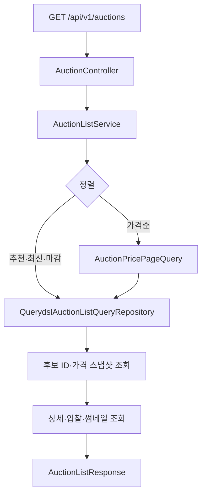
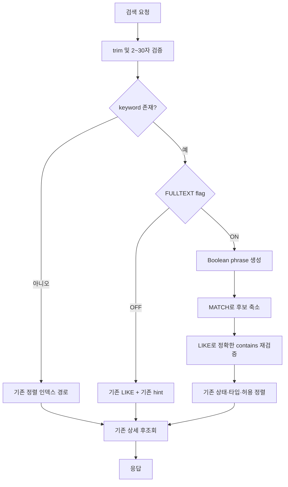

# 경매 제목 n-gram 검색 구현 설계

## 1. 목표

현재 `LIKE '%keyword%'` 제목 검색을 MySQL InnoDB n-gram FULLTEXT 기반으로
개선한다. 구현 범위는 다음과 같다.

- 검색어가 없을 때 기존 목록 쿼리와 인덱스 전략을 그대로 유지한다.
- 검색어가 있을 때 FULLTEXT 역색인으로 후보를 먼저 줄인다.
- 기존 부분 문자열 검색 결과와 비즈니스 정렬 순서를 유지한다.
- 검색 중에는 추천, 최신, 마감임박 정렬만 지원한다.
- 검색어가 없을 때는 기존 낮은 가격, 높은 가격 정렬도 유지한다.
- 기능 플래그로 즉시 기존 `LIKE` 방식으로 되돌릴 수 있게 한다.

초성 검색, 자모 검색, 오타 교정, 자동완성 및 검색 관련도 정렬은 이번 구현
범위에 포함하지 않는다.

## 최종 결정

- 결정일: 2026-08-18
- 상태: 실험 종료 — 현재 구현은 도입하지 않음
- 결정: 전체 `auction` 100만 건에 n-gram FULLTEXT 인덱스를 추가하는 실험
  코드와 V18 migration을 배포 대상에서 제외하고 기존 `LIKE` 검색을 유지한다.
- 근거: 희귀·중빈도 검색은 개선됐지만 고빈도 검색은 느려졌고, 단일 계획에서
  약 2.11GiB의 cgroup 메모리 증가와 반복 측정 중 Docker VM 전역 OOM을
  확인했다. 기능 플래그가 OFF여도 인덱스의 저장·쓰기 비용은 남는다.
- 범위: 현재 작업 트리의 FULLTEXT 코드와 migration은 실험 산출물이며 아직
  정리하지 않았다. 아래 구현·배포 절차는 승인된 rollout 계획이 아니라
  실험 당시 설계와 검증 이력을 보존한 것이다.
- 다음 후보: 활성 경매만 물리적으로 유지하는 검색 전용 테이블을 격리 DB에서
  실제 한글·Zipf 분포와 메모리 안전장치를 적용해 검증한다.

## 구현 진행 로그

### 시도 1 — 비가격 정렬 n-gram 검색

- 시작일: 2026-08-18
- 상태: 부분 성공 — 구현·정확성 검증 완료, 고빈도 성능 실패로 rollout 보류
- 가설: `MATCH ... AGAINST`로 제목 후보를 먼저 줄이고 기존 `LIKE`로 최종
  검증하면 검색 결과를 유지하면서 선행 와일드카드 스캔을 줄일 수 있다.
- 적용 정렬: 추천순, 최신순, 마감임박순
- 제외 정렬: 낮은 가격순, 높은 가격순
- 제외 이유: 가격순은 UP/DOWN 가격 후보와 하향 경매 Top-K를 반복 탐색하므로
  FULLTEXT 효과와 가격 정렬 비용을 한 번에 변경하지 않는다.

구현 범위:

1. `auction.title`에 MySQL n-gram FULLTEXT 인덱스를 추가한다.
2. Hibernate `FunctionContributor`로 `MATCH ... AGAINST`를 QueryDSL에서
   호출한다.
3. 검색어가 있을 때 `MATCH + LIKE` 조건을 사용하고 정렬용 B-Tree 인덱스
   힌트를 제거한다.
4. 검색어는 2~30자로 제한한다.
5. 검색어와 가격순이 함께 요청되면 `400 INVALID_INPUT_VALUE`를 반환한다.
6. 프론트는 검색 중 가격순 선택을 노출하지 않고 직접 URL도 허용 정렬로
   보정한다.
7. 기능 플래그가 꺼져 있으면 기존 `LIKE` 경로를 사용한다.

성공 기준:

- 추천순, 최신순, 마감임박순에서 기존 `LIKE`와 결과 ID 및 순서가 같다.
- 검색어 없는 5개 정렬은 기존 동작을 유지한다.
- 검색어와 가격순 조합은 백엔드에서 거절한다.
- FULLTEXT 활성 쿼리에 기존 정렬용 `USE INDEX`가 남지 않는다.
- 실제 MySQL 8.4 통합 테스트에서 중간 문자열 검색이 성공한다.
- 실패하거나 설계를 변경하면 이 절에 원인, 관찰 결과 및 다음 시도를 먼저
  기록한다.

검증 기록:

- 2026-08-18 검증 1
  - `bidwin-back/./gradlew compileJava`: 코드 컴파일 전에 샌드박스가 사용자
    Gradle 캐시의 `gradle-9.5.1-bin.zip.lck` 쓰기를 거부해 중단됐다.
  - `bidwin-front/npm run build`: 작업 디렉터리에 프런트 의존성이 설치되지
    않아 `vite/client`, `vite` 및 Vite 플러그인 타입을 찾지 못해 중단됐다.
  - 판단: 두 실패 모두 구현 코드의 컴파일 결과가 아니므로 설계를 변경하지
    않는다. Gradle은 캐시 접근 권한을 허용해 재실행하고, 프런트는 lockfile
    기준으로 의존성을 설치한 뒤 다시 검증한다.
- 2026-08-18 검증 2
  - 권한을 허용한 `./gradlew compileJava`는 성공했다.
  - lockfile 기준 `npm ci` 후 `npm run build`는 성공했다.
  - 신규 단위 테스트 실행 전 `compileTestJava`에서 FULLTEXT 인덱스 조회값을
    `List<?>`로 선언한 탓에 AssertJ `containsExactly("FULLTEXT")`의 제네릭
    타입을 결정하지 못해 실패했다.
  - 판단: 제품 코드나 검색 설계 문제가 아닌 테스트 타입 오류다. native query
    결과를 문자열 목록으로 변환한 뒤 같은 테스트를 재실행한다.
- 2026-08-18 검증 3
  - `AuctionListFullTextQueryTest`와 `AuctionControllerTest`가 통과했다.
  - 로컬 MySQL 8.4.10에서 V18 migration을 실제 적용한
    `AuctionTitleFullTextIntegrationTest`가 통과했다.
  - `@@ngram_token_size=2`, `idx_auction_title_ngram=FULLTEXT`, 커밋 후 검색
    노출, `MATCH ... AGAINST` 함수 렌더링 및 추천순·최신순·마감임박순의 결과
    순서를 확인했다.
  - 다음 검증: 플래그가 꺼진 기존 `LIKE` 저장소 회귀 테스트와 전체 빌드를
    실행한다.
- 2026-08-18 검증 4
  - 플래그가 꺼진 `QuerydslAuctionListQueryRepositoryIntegrationTest`가
    통과해 기존 `LIKE` 경로를 확인했다.
  - 전체 백엔드 `./gradlew test`, 프런트 `npm run build`, `npm run lint`,
    `npm run test`가 모두 통과했다.
  - 로컬 테스트 DB의 V18 migration과 테스트 fixture 정리는 정상 완료됐다.
  - 결론: 시도 1의 기능 구현과 로컬 정확성 검증은 완료했다. 아직 100만 건
    데이터의 p95/p99 및 `EXPLAIN ANALYZE`는 측정하지 않았으므로 성능 성공
    여부는 확정하지 않는다.
- 2026-08-18 최종 범위 검토
  - 공통 제목 predicate와 hint helper가 API에서 거절되는 내부 가격순 저장소
    호출에도 FULLTEXT를 적용하고 있음을 확인했다.
  - 이번 시도는 세 가지 비가격 정렬만 대상으로 하므로 FULLTEXT 활성 조건에
    정렬을 포함하고, 상·하향 가격 후보 쿼리는 기존 `LIKE + 가격 인덱스 힌트`
    경로를 그대로 유지하도록 변경 범위를 축소한다.
  - 범위 축소 후 FULLTEXT 통합 테스트, 기존 `LIKE` 저장소 통합 테스트,
    검색어 변환 테스트 및 API 계약 테스트를 함께 재실행해 모두 통과했다.
- 2026-08-18 검증 5 — 로컬 100만 건 실행 계획 비교
  - 로컬 데이터가 정확히 100만 건이며 `2026-08-16 12:00:00` 기준 활성 조건
    `(started_at <= asOf) AND (completed_at IS NULL OR completed_at > asOf)
    AND ended_at > asOf`을 만족하는 행은 30만 건이다.
  - V18 migration의 Flyway `execution_time`은 14,209ms였다. 적용 후
    `idx_auction_title_ngram`은 `FULLTEXT`이고, `information_schema.tables`의
    전체 테이블 data length는 240,926,720 bytes, 전체 index length는
    609,435,648 bytes다. index length는 FULLTEXT 단독 증가량이 아니다.
  - 데이터 제목은 `load-auction-000000` 형태의 고유 합성값이므로 실제 서비스의
    한글·Zipf 단어 분포를 대표하지 않는다.
  - 비교 검색어는 활성 30만 건 중 `load` 30만 건, `99` 11,073건, `9999`
    57건, 단일 매칭 제목 숫자, `zzzz` 0건으로 잡는다. 추천·최신·마감임박의
    기존 `LIKE`와 `MATCH + LIKE` 실행 계획을 같은 warm DB에서 비교한다.
  - 최신순 UP 단일 type·상태 분기의 첫 `EXPLAIN ANALYZE` 결과:

    | 검색어 | 활성 매칭 | 기존 `LIKE` | `MATCH + LIKE` | 관찰 |
    | --- | ---: | ---: | ---: | --- |
    | `zzzz` | 0건 | 436ms | 0.0102ms | FULLTEXT index에서 즉시 0건 판정 |
    | `load` | 30만 건 중 전체 | 246ms | 1,184ms | FULLTEXT posting 100만 건을 읽고 UP 15만 건 정렬 |

  - 기존 최신순 쿼리는 `USE INDEX` hint가 있어도 이 조건에서는 optimizer가
    100만 행 table scan을 선택했다. FULLTEXT는 `idx_auction_title_ngram`을 실제
    사용했다.
  - 첫 관찰만으로 전략을 바꾸지 않는다. 중·저빈도·단일 매칭과 세 정렬을
    측정해 FULLTEXT가 유리해지는 후보 수 경계를 확인한다.
  - UP 단일 type·`completed_at > asOf` 분기의 세 정렬 결과:

    | 정렬 | 검색어 | 기존 `LIKE` | `MATCH + LIKE` |
    | --- | --- | ---: | ---: |
    | 최신 | `zzzz` | 436ms | 0.0102ms |
    | 최신 | `99` | 251ms | 93.1ms |
    | 최신 | `load` | 246ms | 1,184ms |
    | 추천 | `zzzz` | 241ms | 0.00758ms |
    | 추천 | `99` | 233ms | 105ms |
    | 추천 | `load` | 239ms | 892ms |
    | 마감임박 | `zzzz` | 219ms | 0.00579ms |
    | 마감임박 | `99` | 231ms | 47.2ms |
    | 마감임박 | `load` | 237ms | 901ms |

  - 최신순에서 UP과 DOWN type 분기를 순차 실행한 시간을 합산한 값:

    | 검색어 | 활성 매칭 | 기존 `LIKE` | `MATCH + LIKE` |
    | --- | ---: | ---: | ---: |
    | `zzzz` | 0건 | 1,045ms | 0.030ms |
    | type별 단일 제목 숫자 | 총 2건 | 1,097ms | 5.26ms |
    | `9999` | 57건 | 1,148ms | 6.83ms |
    | `99` | 11,073건 | 826ms | 384ms |
    | `load` | 300,000건 | 803ms | 2,491ms |

  - 위 값은 각각 한 번의 warm `EXPLAIN ANALYZE` 실측 합계이며 p95/p99가
    아니다. 실행 순서에 따라 table scan 시간이 변했으므로 절대값보다 후보
    빈도에 따른 방향성을 판단하는 용도로만 사용한다.
  - `completed_at IS NULL`에 해당 행이 없는 분기는 `MATCH`가 있어도 optimizer가
    복합 B-Tree를 선택해 `LIKE` 0.0262ms, FULLTEXT 조건 0.00796ms에 종료됐다.
    FULLTEXT index를 강제하지 않았기 때문에 선택도가 높은 B-Tree 경로는
    보존된다.
  - 판정: 0건·희귀·중빈도 검색은 개선됐지만 모든 제목에 들어 있는 극단적인
    고빈도 검색은 목표를 실패했다. 시도 1은 **부분 성공**이며 기능 플래그는
    기본 OFF를 유지하고 일괄 활성화하지 않는다.
  - 다음 확인: FULLTEXT 경로에서 UP/DOWN type 분할을 제거한 단일 후보 쿼리의
    실행 계획을 먼저 측정한다. posting 중복 조회가 제거돼도 목표를 넘으면
    구현을 확대하지 않고 실제 검색어 분포와 hybrid 기준을 다음 시도로
    설계한다.

### 시도 2 — FULLTEXT 후보 쿼리의 type·상태 분기 통합 사전 검증

- 시작일: 2026-08-18
- 상태: 중단 — 전역 OOM 확인, 코드 미적용
- 가설: FULLTEXT 경로만 UP/DOWN 및 상태 분기를 단일 쿼리로 합치면 같은 posting
  목록을 반복해서 읽는 비용을 줄일 수 있다.
- 사전 검증: 코드를 변경하기 전에 활성 30만 건 조건과 동일한 단일 SQL로
  최신순의 0건·저빈도·중빈도·고빈도, 추천순 고빈도, 마감임박순 고빈도
  `EXPLAIN ANALYZE`를 순차 실행했다.
- 결과: 쿼리 묶음은 약 46초 동안 완료되지 않았고 명령이 exit 137로 종료돼
  실행 계획을 반환하지 못했다. 직후 MySQL 컨테이너는 `RestartCount=1`, 새
  기동 시각으로 확인됐고 XA crash recovery 후 healthy 상태로 복구됐다.
- 직접 원인 — 확정:
  - Docker Desktop VM 커널 로그
    `~/Library/Containers/com.docker.docker/Data/log/vm/init.log.20260818-123951.870`
    4603~4604행에 `global_oom`, `task=mysqld`,
    `Out of memory: Killed process 1152 (mysqld)`가 기록됐다.
  - 종료 당시 `mysqld`의 `anon-rss`는 7,060,880kB(약 6.73GiB), 가상 메모리는
    12,613,224kB였다. Docker VM은 RAM 8GiB이고, 총 swap 약 1GiB 중 남은
    swap은 128kB뿐이었다.
  - 같은 로그 4645행은 `exitCode=137`, `manualRestart=false`,
    `restartPolicy=unless-stopped`, `restartCount=1`을 기록한다. 따라서 Docker
    전체나 사용자가 MySQL을 재시작한 것이 아니라, 커널이 `mysqld`를 SIGKILL한
    뒤 Docker가 해당 컨테이너만 자동 재시작했다.
  - 재시작 후의 `docker inspect State.OOMKilled=false`와 현재 cgroup의
    `oom_kill=0`은 새 실행 상태이므로 이전 실행의 전역 OOM을 반박하지
    않는다.
- 유발 쿼리 범위 — 일부 추정:
  - Docker exec는 12:12:12 KST에 시작됐고 OOM은 12:13:03 KST에 발생했다.
    `EXPLAIN ANALYZE`는 실행 계획만 만드는 명령이 아니라 쿼리를 실제로
    [실행한다](https://dev.mysql.com/doc/refman/8.4/en/explain.html).
  - 실행 순서는 최신순 0건·저빈도·중빈도·고빈도(`load`), 추천순 `load`,
    마감임박순 `load`였다. general/slow query log가 꺼져 있었고 묶음 출력도
    반환되지 않아 사망 시 실행 중이던 단일 SQL은 확정할 수 없다.
  - 이 묶음 전에도 같은 `mysqld`에서 type·상태 분기별 `load` 고빈도
    `EXPLAIN ANALYZE`를 여러 번 실행했다. 묶음 시작 직전 RSS는 수집하지
    않았으므로 시작 시점에 이미 남아 있던 메모리 크기는 알 수 없다.
  - 앞선 개별 측정 시간과 후보 수를 보면 첫 세 쿼리보다, FULLTEXT posting
    100만 건을 읽고 활성 약 30만 건을 정렬하는 첫 `load` 통합 쿼리가 가장
    유력하다. 이어지는 추천순·마감임박순 `load` 실행의 메모리 누적
    기여도 배제할 수 없다. 아래 단일 쿼리 재현에서 약 2.1GiB가 즉시 OS에
    반환되지 않은 점을 함께 보면, 단일 SQL 하나보다 전체 고빈도 벤치마크
    순서가 RSS를 누적시키고 통합 `load`가 임계점을 넘겼을 가능성이 가장
    높다.
- 메모리 증가 경로:
  - `innodb_buffer_pool_size`는 256MiB지만 MySQL 전체 메모리 상한이 아니다.
    당시 `innodb_ft_result_cache_limit`은 기본값 2,000,000,000 bytes로,
    FULLTEXT 쿼리 또는 스레드별 중간·최종 결과를 메모리에 둘 수 있다. 이
    변수는 FTS 결과 캐시만 제한하며 정렬, 임시 테이블, 연결별 버퍼와 기타
    MySQL 메모리는 포함하지
    [않는다](https://dev.mysql.com/doc/refman/8.4/en/innodb-parameters.html#sysvar_innodb_ft_result_cache_limit).
  - `load` 정적 `EXPLAIN FORMAT=TREE`는 FULLTEXT 예상 행을 1건으로 잡았지만,
    앞선 `EXPLAIN ANALYZE`에서는 실제 posting 100만 건을 읽었다. FULLTEXT
    후보를 모두 상태 필터링한 뒤 `created_at, id` 등 비관련도 컬럼으로
    정렬하므로 `LIMIT 16`만으로 후보 생성과 정렬 메모리를 조기에 제한할 수
    없다. MySQL의 FULLTEXT Top-N 최적화는 다른 `WHERE` 없이 관련도 내림차순
    정렬을 하는 제한적인 쿼리가 대상이므로 현재 목록 쿼리는 해당하지 않는다.
  - 포렌식 중 재시작 직후의 DB에서 고빈도 `load` 통합 쿼리 하나를
    `EXPLAIN FORMAT=TREE`로 확인하자 컨테이너 메모리가 약 877MiB에서
    2.956GiB로 증가했다. cgroup `memory.current`도 1,577,627,648 bytes에서
    3,844,329,472 bytes로 약 2.11GiB 증가했고 명령 종료 후에도 반환되지
    않았다. MySQL은 FULLTEXT 표현식을 일반 정적 계획처럼 추정만 하지 않고
    최적화 단계에서 실제
    [평가한다](https://dev.mysql.com/doc/refman/8.4/en/column-indexes.html#column-indexes-fulltext).
    따라서 고빈도 FULLTEXT에는 `EXPLAIN`도 메모리 관점에서 안전한 사전
    점검이 아니다. 이 약 2.08GiB 증가량은 2,000,000,000-byte FTS 결과 캐시
    상한과 부가 할당이 실제 프로세스 RSS를 크게 늘릴 수 있음을 재현한다.
  - 같은 실행의 Performance Schema 최고값은 `memory/innodb/memory`
    1,842.5MiB와 `memory/innodb/ut0rbt` 347.2MiB였다. 반면
    `memory/temptable/physical_ram`은 17.0MiB, `THD::main_mem_root`는
    18.5MiB였다. 이 재현에서는 TempTable이나 일반 세션 버퍼보다 FULLTEXT
    결과 처리를 포함하는 InnoDB 내부 구조가 메모리 급증의 주경로로
    관찰됐다.
  - 명령 종료 후 위 두 InnoDB 항목의 현재값은 각각 11.4MiB와 0으로
    내려왔지만 `mysqld`의 `RssAnon`은 약 2.91GiB, cgroup 메모리는 약
    3.58GiB로 유지됐다. 쿼리 객체의 논리적 해제와 별개로 MySQL 메모리
    allocator가 확보한 페이지가 즉시 OS에 반환되지 않아 반복 측정의 RSS
    누적 조건이 됐다.
  - 커널 로그의 `file-rss`는 184kB, `anon-rss`는 약 6.73GiB다. 파일 캐시가
    아니라 쿼리 중간 결과를 포함한 프로세스 익명 메모리 증가가 VM을
    고갈시킨 것이다. 다만 6.73GiB의 내부 할당별 비율과 해제되지 않은 이전
    측정 메모리의 비율은 사후 로그만으로 분해할 수 없다.
- 판단: 30만 건 통합 정렬에서 DB 안정성 위험이 관찰됐으므로 근거 없이
  애플리케이션 구조를 변경하지 않는다.
- 복구 확인: 재시작 후 `auction` 1,000,000건, Flyway V18 `success=1`,
  `idx_auction_title_ngram=FULLTEXT`가 그대로 유지됨을 확인했다.
- 결론: 시도 2 코드는 적용하지 않는다. 같은 쿼리 묶음을 현재 공유 VM에서
  재실행하지 않고, 고빈도 검색어는 일반 `EXPLAIN`도 현재 설정으로 다시
  실행하지 않는다. 최종 검토에서 기능 플래그 OFF만으로는 인덱스의 저장·쓰기
  비용을 제거할 수 없다고 판단해 시도 1 구현도 배포 대상에서 제외한다.
  다음 성능 검증은 격리 DB에서 쿼리를 한 개씩 실행하고, FTS 쿼리 메모리
  상한·컨테이너 메모리 상한·타임아웃·실행 중 RSS 수집을 먼저 적용한 뒤
  진행한다. 실제 한글·Zipf 제목과 운영 검색어 빈도를 준비하고 후보 수 상한을
  둔 hybrid 선택을 별도로 설계한다.

## 2. 핵심 설계 결정

### 2.1 기존 조회 구조를 유지한다

현재 조회 흐름은 다음과 같다.



검색만을 위해 별도 저장소에서 일치하는 모든 경매 ID를 조회한 뒤 거대한
`IN` 조건으로 넘기는 방식은 사용하지 않는다. 고빈도 검색어에서는 수만에서
수십만 개 ID를 애플리케이션 메모리에 올려야 하고, 기존의 가격 Top-K 및
페이지 정렬을 다시 구현해야 하기 때문이다.

대신 Hibernate에 MySQL `MATCH ... AGAINST` 문법을 사용자 정의 함수로
등록한다. 기존 QueryDSL 쿼리의 공통 제목 predicate만 교체하여 현재 상태
분기, 가격 Top-K, 후보 후조회 구조를 재사용한다.

### 2.2 FULLTEXT는 후보 축소, LIKE는 정확성 검증에 사용한다

FULLTEXT 검색 결과를 그대로 반환하지 않고 다음 두 조건을 함께 사용한다.

```sql
MATCH(a.title) AGAINST ('"가격"' IN BOOLEAN MODE) > 0
AND a.title LIKE '%가격%' ESCAPE '!'
```

- `MATCH`는 FULLTEXT 역색인으로 후보를 좁힌다.
- `LIKE`는 기존 부분 문자열 의미를 최종 검증한다.
- FULLTEXT relevance는 정렬에 사용하지 않는다.
- 최종 정렬은 기존 추천 또는 시각 기준을 그대로 사용한다.

이 방식은 n-gram phrase 검색과 기존 `LIKE`의 공백·구두점 해석 차이로 인해
잘못된 결과가 추가되는 것을 방지한다. 단, FULLTEXT에서 후보가 누락되는
false negative는 `LIKE`로 복구할 수 없으므로 검색어 변환과 stopword 정책을
통합 테스트로 검증해야 한다.

### 2.3 검색어가 없는 경로는 변경하지 않는다

```text
keyword == null
  → 제목 predicate 없음
  → 현재 상태·타입 분기 유지
  → 현재 B-Tree 인덱스 힌트 유지

keyword != null && fulltext-enabled == false
  → 현재 LIKE predicate 사용
  → 현재 B-Tree 인덱스 힌트 유지

keyword != null && fulltext-enabled == true
  → MATCH predicate + LIKE 최종 검증
  → 기존 B-Tree 인덱스 힌트 생략
```

MySQL의 `MATCH`는 FULLTEXT 인덱스와 정확히 대응해야 한다. 현재 Hibernate의
DB query hint는 MySQL `USE INDEX`로 변환되므로 검색 경로에 정렬용 B-Tree
인덱스를 지정하면 FULLTEXT 인덱스 선택을 방해할 수 있다.

### 2.4 1차 구현에서는 상태·타입 분기를 유지한다

현재 repository는 B-Tree 인덱스를 활용하기 위해 상태의 `OR` 조건과 전체
경매 타입을 여러 쿼리로 분리한 뒤 애플리케이션에서 병합한다. FULLTEXT
경로에서는 같은 검색이 분기마다 반복될 수 있지만, 1차 구현에서는 다음
이유로 기존 분기를 유지한다.

- 페이지 순서와 동률 처리 로직의 변경을 최소화한다.
- 가격순 Top-K의 경계 조건을 그대로 보존한다.
- FULLTEXT 적용 효과와 분기 반복 비용을 분리해 측정할 수 있다.

부하 테스트에서 반복 FULLTEXT 조회가 병목으로 확인될 때만 검색어가 있는
경로에 한해 상태 분기와 UP/DOWN 분기를 합친다. 근거 없이 두 최적화를 한 번에
적용하지 않는다.

## 3. 검색어 계약

### 3.1 입력 규칙

권장 검색어 계약은 다음과 같다.

- 앞뒤 공백을 제거한 후 빈 문자열이면 검색 조건 없음
- 최소 2자, 최대 30자
- 한글, 영문, 숫자 및 제목에 허용되는 일반 특수문자 지원
- 검색 문자열은 SQL에 보간하지 않고 항상 bind parameter로 전달
- MySQL Boolean FULLTEXT 연산자는 phrase builder에서 처리

기본 `ngram_token_size=2`에서 한 글자 검색을 `LIKE`로 fallback하면 기존
최악 지연이 다시 발생한다. 성능 목표를 일관되게 보장하기 위해 한 글자
검색은 API에서 `400 INVALID_INPUT_VALUE`로 거절한다.

예상 오류 메시지:

```text
검색어는 2자 이상 30자 이하로 입력해주세요.
```

프론트 검색 입력에도 `minLength={2}`를 지정하되 서버 검증을 최종 기준으로
삼는다.

### 3.2 Boolean phrase 생성

`AuctionListFullTextQuery`는 원본 검색어를 MySQL Boolean phrase로 변환한다.

```text
가격     → "가격"
아이폰   → "아이폰"
```

역할은 다음으로 제한한다.

- 길이 invariant 재검증
- `\`와 `"` 처리
- Boolean phrase 생성
- 변환 불가능한 입력을 명시적으로 거절

FULLTEXT 변환 실패 시 요청 중간에 자동으로 `LIKE` 전체 스캔으로 fallback하지
않는다. 기능 전체 rollback은 `fulltext-enabled` 플래그로 수행한다. 자동
fallback은 DB 장애를 숨기고 한 요청에서 느린 쿼리를 다시 실행할 수 있기
때문이다.

## 4. DB 마이그레이션

### 4.1 서버 설정

모든 환경에서 다음 값을 고정한다.

```text
ngram_token_size=2
```

`ngram_token_size`는 서버 시작 시 결정되는 read-only 설정이다. 로컬 MySQL은
[`compose.local.yaml`](../compose.local.yaml)에 다음 옵션을 명시한다.

```yaml
command:
  - --ngram-token-size=2
```

CI의 MySQL 8.4는 기본값 2를 사용하되 통합 테스트에서
`SELECT @@ngram_token_size`가 2인지 검증한다. 운영 DB도 인덱스 생성 전에 같은
값인지 확인해야 한다. 값을 변경하면 MySQL 재시작과 FULLTEXT 인덱스 재생성이
필요하다.

### 4.2 stopword 정책

기본 stopword는 literal 부분 문자열 검색과 맞지 않는다. n-gram parser는
stopword를 포함하는 토큰을 제외할 수 있으므로 이 인덱스는 stopword 없이
생성한다.

신규 Flyway 파일:

```text
bidwin-back/src/main/resources/db/migration/
V18__add_auction_title_ngram_fulltext_index.sql
```

예상 SQL:

```sql
SET @previous_innodb_ft_enable_stopword =
    @@SESSION.innodb_ft_enable_stopword;

SET SESSION innodb_ft_enable_stopword = OFF;

CREATE FULLTEXT INDEX idx_auction_title_ngram
    ON auction (title)
    WITH PARSER ngram;

SET SESSION innodb_ft_enable_stopword =
    @previous_innodb_ft_enable_stopword;
```

FULLTEXT와 n-gram parser는 JPA `@Table(indexes = ...)`로 정확히 표현할 수
없으므로 `Auction` 엔티티에는 인덱스 어노테이션을 추가하지 않는다. 스키마의
단일 기준은 Flyway migration으로 유지한다.

### 4.3 마이그레이션 운영 제약

이 테이블의 첫 FULLTEXT 인덱스를 추가하면 InnoDB가 내부 `FTS_DOC_ID`를
추가하면서 테이블을 재구성한다. MySQL 8.4에서 FULLTEXT 인덱스 추가는
in-place DDL을 지원하지만 동시 DML은 허용하지 않는다.

따라서 애플리케이션 시작 시 운영 DB에서 처음 실행되도록 방치하지 않는다.

1. 운영과 같은 100만 건 staging 데이터로 생성 시간과 추가 디스크 사용량을
   측정한다.
2. 운영의 `ngram_token_size`, MySQL 버전 및 디스크 여유를 확인한다.
3. 쓰기를 중지할 수 있는 maintenance window를 확보한다.
4. 신규 애플리케이션 기동 전에 별도 Flyway migration job으로 V18을 실행한다.
5. `flyway_schema_history`와 `information_schema.statistics`에서 완료를 확인한다.
6. 쓰기를 재개한 뒤 애플리케이션을 배포한다.

maintenance window를 확보할 수 없다면 구현을 진행하기 전에 online schema
change 도구 또는 shadow table 전환을 별도 설계해야 한다. 첫 배포에서 임의로
추가하지 않는다.

## 5. 애플리케이션 구현

### 5.1 Hibernate 함수 등록

MySQL `MATCH ... AGAINST`는 JPQL 표준 함수가 아니다. Hibernate 7.4의
`FunctionContributor`로 다음 함수를 등록한다.

```java
public final class MySqlFullTextFunctionContributor
        implements FunctionContributor {

    @Override
    public void contributeFunctions(FunctionContributions contributions) {
        BasicType<Double> doubleType = contributions
                .getTypeConfiguration()
                .getBasicTypeRegistry()
                .resolve(StandardBasicTypes.DOUBLE);

        contributions.getFunctionRegistry().registerPattern(
                "match_against_boolean",
                "match (?1) against (?2 in boolean mode)",
                doubleType
        );
    }
}
```

ServiceLoader 등록 파일을 함께 추가한다.

```text
bidwin-back/src/main/resources/META-INF/services/
org.hibernate.boot.model.FunctionContributor
```

파일 내용:

```text
com.tikitaka.bidwinback.auction.infrastructure.MySqlFullTextFunctionContributor
```

함수는 relevance를 나타내는 `DOUBLE`을 반환하고 QueryDSL에서 `> 0` 조건으로
사용한다. 실제 Hibernate 7.4 + QueryDSL 7.5 조합의 SQL 렌더링은 MySQL 통합
테스트로 검증한다.

### 5.2 검색 기능 플래그

설정값을 추가한다.

```yaml
app:
  auction:
    search:
      fulltext-enabled: ${AUCTION_SEARCH_FULLTEXT_ENABLED:false}
```

`AuctionSearchProperties`는 이 값만 제공한다. 검색 최소 길이와
`ngram_token_size`는 서로 달라지면 안 되므로 임의의 런타임 설정으로 만들지
않고 코드와 DB 설정에서 2로 고정한다.

현재 설정 클래스 등록 관례에 맞춰 `AuctionSearchConfig`에서
`@EnableConfigurationProperties(AuctionSearchProperties.class)`로 등록한다.

플래그의 목적은 다음과 같다.

- 인덱스 생성 후 코드를 안전하게 배포
- 일부 인스턴스에서 canary 활성화
- 문제 발생 시 스키마를 되돌리지 않고 즉시 기존 `LIKE`로 rollback

### 5.3 QueryDSL 검색 predicate

`QuerydslAuctionListQueryRepository.titleContains()`를
`titleMatches()`로 변경한다.

개념 코드는 다음과 같다.

```java
private BooleanExpression titleMatches(
        StringExpression title,
        AuctionListSearchCondition condition
) {
    String keyword = condition.keyword();
    if (keyword == null) {
        return null;
    }

    BooleanExpression exactContains = title.like(
            "%" + AuctionListKeywordEscaper.escape(keyword) + "%",
            AuctionListKeywordEscaper.LIKE_ESCAPE
    );
    if (!isFullTextSearch(condition)) {
        return exactContains;
    }

    NumberExpression<Double> fullTextScore = Expressions.numberTemplate(
            Double.class,
            "function('match_against_boolean', {0}, {1})",
            title,
            AuctionListFullTextQuery.from(keyword).value()
    );
    return fullTextScore.gt(0.0).and(exactContains);
}
```

이 메서드는 기존 두 공통 predicate에서 사용하되 정렬까지 확인한다.

- 추천, 최신, 마감임박: 플래그가 켜져 있으면 `MATCH + LIKE`
- 낮은 가격, 높은 가격: 항상 기존 `LIKE`

`AuctionListQuery`가 검색어와 가격순 조합을 먼저 거절한다. 저장소도 정렬을
FULLTEXT 활성 조건에 포함하여 내부 직접 호출에서 가격 경로가 바뀌지 않게
방어한다.

### 5.4 인덱스 힌트 조건부 적용

현재 정렬별 query에는 MySQL `USE INDEX`로 변환되는 database hint가 있다.
다음 helper로 적용 조건을 한 곳에 모은다.

```java
private <T> JPAQuery<T> applyIndexHint(
        JPAQuery<T> query,
        AuctionListSearchCondition condition,
        String indexHint
) {
    if (!isFullTextSearch(condition)) {
        query.setHint(HibernateHints.HINT_QUERY_DATABASE, indexHint);
    }
    return query;
}
```

다음 후보 조회의 직접적인 `.setHint(...)`를 helper 호출로 바꾼다.

- 목록 count
- 최신/마감 후보
- 추천 후보

상향·하향 가격 후보의 인덱스 힌트는 변경하지 않는다.

검색 경로에서는 FULLTEXT 인덱스를 별도로 강제하지 않고 optimizer 선택과
`EXPLAIN ANALYZE` 결과를 먼저 확인한다. 검색어가 없는 기존 경로의 힌트는
그대로 유지한다.

## 6. 요청 처리 흐름



## 7. 변경 파일

### 신규 파일

| 파일 | 역할 |
| --- | --- |
| `V18__add_auction_title_ngram_fulltext_index.sql` | stopword 비활성 n-gram FULLTEXT 인덱스 생성 |
| `MySqlFullTextFunctionContributor.java` | Hibernate `MATCH ... AGAINST` 렌더링 등록 |
| `META-INF/services/org.hibernate.boot.model.FunctionContributor` | FunctionContributor ServiceLoader 등록 |
| `AuctionListFullTextQuery.java` | Boolean phrase 생성과 검색어 invariant 검증 |
| `AuctionSearchProperties.java` | FULLTEXT rollout 플래그 |
| `AuctionSearchConfig.java` | 검색 설정 properties 등록 |
| `AuctionListFullTextQueryTest.java` | phrase 변환 단위 테스트 |
| `AuctionTitleFullTextIntegrationTest.java` | 실제 MySQL FULLTEXT 통합 테스트 |

### 수정 파일

| 파일 | 변경 |
| --- | --- |
| `QuerydslAuctionListQueryRepository.java` | 공통 제목 predicate와 조건부 인덱스 힌트 |
| `AuctionListQuery.java` | 검색어 trim·2~30자 검증 및 검색 중 가격순 거절 |
| `AuctionController.java` | 검색 계약 OpenAPI 설명 |
| `application.yaml` | `fulltext-enabled` 설정 |
| `compose.local.yaml` | `--ngram-token-size=2` 고정 |
| `TopNav.tsx` | 검색 입력 `minLength={2}` |
| `query.ts` | 검색 중 허용 정렬과 가격순 보정 함수 |
| `AuctionToolbar.tsx` | 검색 중 세 가지 정렬만 노출 |
| `auctions/page.tsx` | 요청·캐시 키·툴바 정렬을 허용 값으로 보정 |
| `AuctionControllerTest.java` | 검색어 경계값 API 테스트 |

## 8. 테스트 설계

### 8.1 단위 테스트

`AuctionListFullTextQueryTest`:

- 2자 및 30자 검색어를 phrase로 변환
- 1자 및 31자 검색어 거절
- Boolean 연산자와 따옴표가 포함된 입력 처리
- SQL 문자열을 직접 조립하지 않고 값만 반환하는지 검증

`AuctionControllerTest`:

- 공백 검색어는 검색 조건 없음
- 한 글자 검색은 400
- 두 글자 검색은 service로 전달
- 30자는 허용, 31자는 400

### 8.2 MySQL 통합 테스트

기존 repository 통합 테스트는 클래스 전체가 `@Transactional`이다. InnoDB
FULLTEXT의 INSERT/UPDATE는 commit 시점에 색인되므로 같은 transaction에서
생성한 fixture는 FULLTEXT 검색으로 보이지 않는다.

따라서 `AuctionTitleFullTextIntegrationTest`를 별도 클래스로 만들고 다음
순서를 사용한다.

1. `TransactionTemplate`로 fixture를 저장하고 commit한다.
2. 새 read-only transaction에서 repository 검색을 실행한다.
3. 별도 transaction에서 fixture를 정리하고 commit한다.

필수 검증:

- `@@ngram_token_size = 2`
- `idx_auction_title_ngram`의 `index_type = FULLTEXT`
- 제목 앞, 중간, 뒤의 2글자 이상 검색
- 한글, 영문 대소문자, 숫자 및 혼합 제목
- 공백과 특수문자 검색
- `MATCH + LIKE` 결과와 기준 `LIKE` 결과의 ID 집합 동일성
- ACTIVE/ENDED, UP/DOWN, 카테고리 필터
- 추천, 최신, 마감임박 정렬
- 페이지 offset과 동률 ID 순서
- 경매 commit 후 검색 노출

통합 테스트 프로퍼티는 다음처럼 FULLTEXT를 명시적으로 활성화한다.

```text
app.auction.search.fulltext-enabled=true
```

기존 통합 테스트는 기본값 `false`로 현재 LIKE 경로의 회귀 테스트 역할을
유지한다.

### 8.3 실행 계획 검증

대표 쿼리에 `EXPLAIN ANALYZE`를 실행하여 다음을 확인한다.

- `idx_auction_title_ngram` 사용 여부
- 실제 읽은 후보 행 수
- 정렬 대상 행 수와 filesort 비용
- 기존 B-Tree `USE INDEX`가 FULLTEXT 쿼리에 남지 않았는지
- 상태 및 타입 분기별 FULLTEXT 반복 비용

CI에는 100만 건 성능 테스트를 넣지 않는다. CI는 정확성과 실제 MySQL 문법을
검증하고, 100만 건 부하 테스트는 동일 사양의 staging에서 별도로 실행한다.

## 9. 배포와 rollback

### 배포

1. staging 100만 건으로 인덱스 생성 시간, 잠금 시간 및 디스크를 측정한다.
2. 운영 MySQL 설정을 확인하고 maintenance window를 확정한다.
3. 쓰기를 중지하고 V18 migration job을 먼저 실행한다.
4. 인덱스와 Flyway 이력을 확인한 뒤 쓰기를 재개한다.
5. 애플리케이션을 `fulltext-enabled=false`로 배포한다.
6. 한 인스턴스에서 flag를 활성화하고 p95/p99 및 DB 자원을 확인한다.
7. 모든 인스턴스에서 활성화한다.

### rollback

1. `AUCTION_SEARCH_FULLTEXT_ENABLED=false`로 전환한다.
2. 기존 `LIKE` 경로 복귀와 오류율을 확인한다.
3. FULLTEXT 인덱스는 즉시 삭제하지 않는다.
4. 원인 분석 후 필요할 때만 후속 migration으로 인덱스를 제거한다.

런타임 오류가 발생했다고 같은 요청에서 `LIKE`를 재실행하지 않는다. 명시적
flag rollback만 허용한다.

## 10. 완료 조건

- 지원 검색어에서 기존 `LIKE`와 결과 및 정렬이 동일하다.
- 검색어 없는 요청의 SQL과 실행 계획이 기존과 동일하다.
- FULLTEXT 요청에 기존 정렬용 `USE INDEX`가 포함되지 않는다.
- 100만/30만 데이터에서 p95 500ms, p99 1초 이하를 만족한다.
- 경매 등록 p95 성능 저하가 10% 이내다.
- 마이그레이션 소요 시간, DML 중단 시간 및 추가 디스크 요구량이 기록된다.
- 기능 플래그만으로 기존 검색 방식으로 복귀할 수 있다.

## 11. 후속 최적화 조건

다음 최적화는 측정 결과가 필요할 때만 수행한다.

- FULLTEXT가 상태 branch마다 반복되면 검색 경로의 상태 `OR`를 단일 쿼리로
  통합한다.
- 전체 타입 검색에서 UP/DOWN 중복 조회가 크면 비가격 정렬만 단일 쿼리로
  통합한다.
- 고빈도 검색어의 정렬이 목표를 넘으면 활성 경매 검색 projection 또는 별도
  검색엔진을 검토한다.
- MySQL 검색 부하가 입찰 transaction에 영향을 주면 Elasticsearch/OpenSearch
  분리를 검토한다.

## 12. 참고 자료

- [MySQL 8.4 ngram Full-Text Parser](https://dev.mysql.com/doc/refman/8.4/en/fulltext-search-ngram.html)
- [MySQL 8.4 InnoDB Full-Text Indexes](https://dev.mysql.com/doc/refman/8.4/en/innodb-fulltext-index.html)
- [MySQL 8.4 Online DDL Operations](https://dev.mysql.com/doc/refman/8.4/en/innodb-online-ddl-operations.html)
- [MySQL 8.4 Full-Text Restrictions](https://dev.mysql.com/doc/refman/8.4/en/fulltext-restrictions.html)
